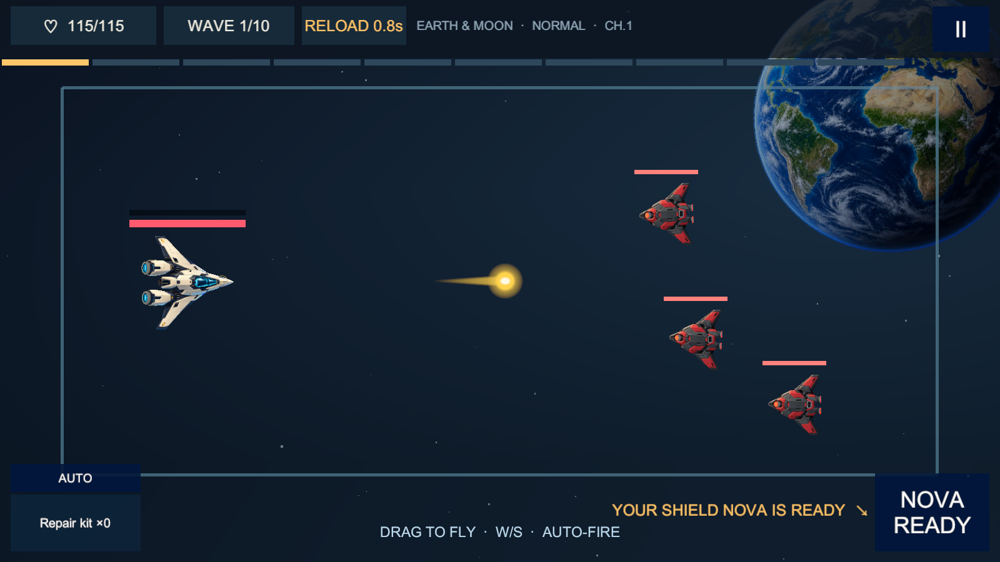
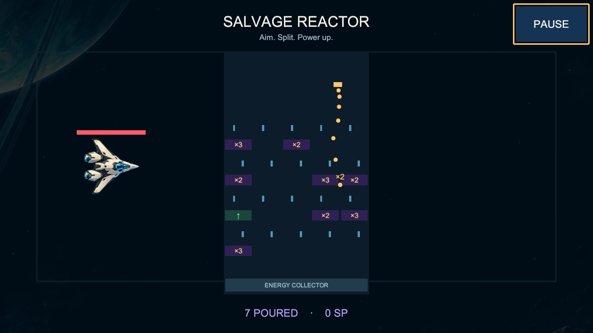
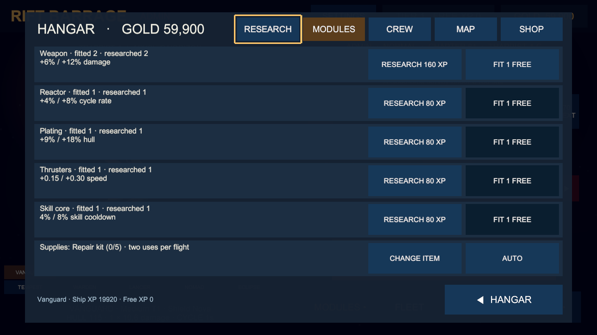
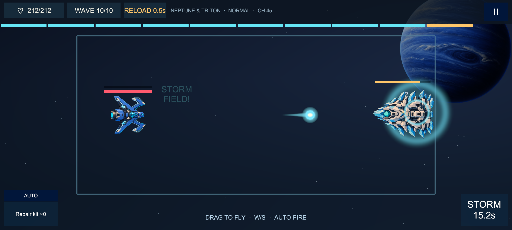

# Rift Barrage

A landscape space shooter: dodge, auto-fire and make every wave count. Leave Earth orbit and fight your way out through the solar system, one sector at a time. Multiply your salvage in the reactor and build a new arsenal every flight.

**Website:** [riftbarrage.cristiangirlea.ro](https://riftbarrage.cristiangirlea.ro)

## Download (preview 0.3.0)

| Platform | File | Requirements |
| --- | --- | --- |
| Android | [RiftBarrage-android.apk](https://github.com/cristiangirlea/rift-barrage/releases/latest/download/RiftBarrage-android.apk) | Android 7.1 or newer, 64-bit ARM |
| Windows | [RiftBarrage-windows-x64.zip](https://github.com/cristiangirlea/rift-barrage/releases/latest/download/RiftBarrage-windows-x64.zip) | Windows 10/11, 64-bit |
| Linux | not yet available | |

Every release lists SHA-256 checksums in `SHA256SUMS.txt`.

- **Android:** open the APK and allow installing from your browser when asked.
- **Windows:** unzip and run `RiftBarrage.exe`. SmartScreen may warn about an unrecognized app (choose *More info → Run anyway*).

This is an early preview. Balance will change, and later previews may not keep your progress.

## New in 0.3.0

- **Detailed 3D fleet and curved planets:** the painted finish and familiar 2.5D controls remain.
- **Ship research:** 19 first-build hulls, bounded modules and class crews replace the old upgrade, gear and pilot progression.
- **Class handling:** light, medium and heavy ships accelerate and brake differently.
- **100 available chapters:** later route content remains in development.

Earlier preview saves are archived locally and converted to the research system. Old upgrades are not retained in their previous form. Physical-phone performance verification for the new models is still pending.

## New in 0.2.2

- **Smoother steering:** the ship races toward your finger and brakes where you point; keyboard and gamepad accelerate and brake the same way.

## New in 0.2.1

- **Region chests:** stars and missions across a region's five chapters open Silver, Gold and Platinum chests; better tiers later pay the difference.
- **New chapter missions:** three per chapter from a new set, tracked separately on each difficulty.

## New in 0.2.0

- **Bosses fight back:** telegraphed attacks and an enraged second phase.
- **More enemies:** new types with their own tactics, formations and elites.
- **Livelier ships:** banking, recoil and hit reactions.
- **No ship left behind:** deeper in, ships that slip past swing back around.
- **A bigger fleet** and **a new look:** a new icon and launch intro.

## What is in the preview

- **A growing fleet:** launch in the Vanguard; new ships join as you push further out, each with its own guns, sound and skill.
- **The salvage reactor:** aim and release your cores through ×2/×3 gates, catapults and counter locks, then spend the points on upgrades for the run.
- **The long way out:** every sector takes you further from home, with stars, chapter missions, harder modes and an endless Infinite Mode.
- **Permanent progress:** ship research, fitted modules, class crews, region chests and daily supplies.

## Screenshots

| | |
| --- | --- |
|  |  |
|  |  |

## Privacy

The current preview has no account, ads, purchases, analytics or crash reporting, and progress is saved only on your device. Later versions will add online play, optional rewarded ads and purchases; the privacy page will describe any change before it ships. See [site/privacy](site/privacy/index.html) or [riftbarrage.cristiangirlea.ro/privacy](https://riftbarrage.cristiangirlea.ro/privacy/).

## About this repository

This repository hosts the public website (`site/`), the screenshots and the release downloads. The game's source code is not published here.

© 2026 Cristian Gîrlea. All rights reserved. See [LICENSE.md](LICENSE.md).
